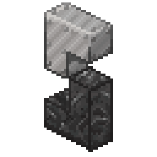
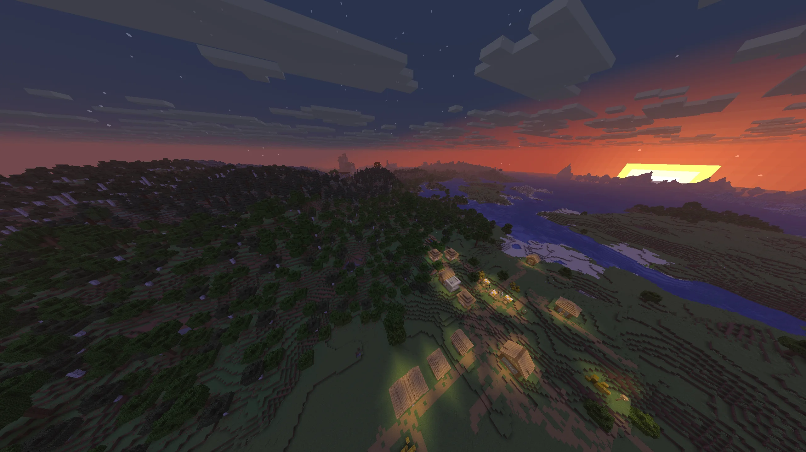

<p align="center">
  
</p>

<h1 align="center">SteelMC</h1>

<p align="center">
  A Minecraft Java Edition server written in Rust.
</p>

<p align="center">
  <a href="https://github.com/Steel-Foundation/SteelMC/releases"></a>
  <a href="https://github.com/Steel-Foundation/SteelMC/actions/workflows/test.yml"></a>
  <a href="https://github.com/Steel-Foundation/SteelMC/actions/workflows/lint.yml"></a>
  <a href="LICENSE"></a>
</p>

<p align="center">
  <a href="https://steelmc.dev/">Website</a> ·
  <a href="https://steelmc.dev/getting-started/introduction/">Documentation</a> ·
  <a href="https://steelmc.dev/tracker">Implementation tracker</a> ·
  <a href="https://steelmc.dev/discord">Discord</a>
</p>



> [!IMPORTANT]
> SteelMC is still pre-alpha. You can connect and explore generated worlds, but
> survival gameplay is incomplete and many vanilla systems are still missing. Do not
> replace your production server with it yet.

## What is SteelMC?

SteelMC is an independent implementation of the Minecraft Java Edition server. It
tracks the latest Java Edition release and currently targets **Minecraft 26.2**.

The goal is to match vanilla behavior while making better use of modern multicore
hardware. Gameplay updates remain synchronous, while chunk generation, lighting,
packet processing, and chunk sending can run outside the main tick.

## World generation

World generation is currently the most complete part of SteelMC. Its parity suite
compares 7,500 randomly selected chunks with a reproducible vanilla reference: 2,500
in each dimension. All tested chunks match block for block. Entity spawning is not
included because most entity behavior has not been implemented yet.

In a focused benchmark on a Ryzen 9 9950X, SteelMC generated a fresh
10,201-chunk Overworld area in a median of 3.98 seconds. Results vary with hardware,
and this benchmark does not represent every server workload.

Read [Introducing SteelMC](https://steelmc.dev/blog/announcement/) for the design
story, parity methodology, benchmark context, and limitations. Full results and
reproduction instructions are available on the
[benchmark page](https://steelmc.dev/reference/benchmarks/).

## Current status

Today, clients can join a persistent multiplayer world, move and interact, use
inventories and commands, and return later to saved chunks. SteelMC currently
provides:

- Java Edition networking, authentication, encryption, and compression
- Persistent chunk generation, loading, saving, and lighting
- Player movement, collision, block interaction, and inventories
- Commands, permissions, chat, and server configuration
- Early entity, block entity, and gameplay behavior implementations

SteelMC is not ready to replace an established server:

- Survival gameplay is incomplete.
- Only a small number of entities have meaningful behavior.
- Full vanilla and protocol parity have not been reached.
- Plugins are not available yet.
- Paper, Bukkit, Fabric, Forge, and NeoForge extensions are not compatible.

Follow the [implementation tracker](https://steelmc.dev/tracker) for a more detailed
view of what is available today.

## Try it

Pre-built releases, Docker images, and source-build instructions are available in
the [installation guide](https://steelmc.dev/getting-started/installation/).

Expect bugs and incomplete mechanics. If you try SteelMC, please share what you find
on [Discord](https://steelmc.dev/discord) or open a
[GitHub issue](https://github.com/Steel-Foundation/SteelMC/issues).

## Contributing

Contributions are welcome. Most changes begin by reading the vanilla source,
understanding the behavior it implements, and deciding how to express that behavior
cleanly in Rust.

Before you start:

1. Check existing issues and pull requests, then discuss substantial changes with
   the community.
2. Read the [contributor guide](https://steelmc.dev/development/start-contributing/)
   and [code standards](https://steelmc.dev/development/code-standard/).
3. Generate the targeted vanilla source with `./update-minecraft-src.sh` and verify
   behavior against it.
4. Run the relevant tests and checks before opening a pull request.

The repository uses a pinned nightly Rust toolchain. The common validation commands
are:

```bash
cargo test
cargo fmt --all --check
cargo clippy -r --all-targets --all-features
typos
```

Nix and NixOS users can get the pinned toolchain, `lld`, `prek`, and `typos` in one
step with `nix develop` (or `direnv allow`, using the checked-in `.envrc`).

Generated documentation for SteelMC's Rust crates is available in the
[Rust API reference](https://rustdoc.steelmc.dev/steel_core/index.html).

AI may be used as a tool, but contributors must understand and be able to explain
every line they submit. Fully autonomous pull requests are not accepted.

For an easy entry into SteelMC as a new contributor, you can check out issues with the tag `good first issue`, or our [tracker](https://steelmc.dev/tracker/) of unimplemented content,
which is always a good first start.

## Community

The [SteelMC Discord](https://steelmc.dev/discord) is where we discuss designs,
coordinate work, share progress, and answer questions. Longer project updates are
published on the [SteelMC website](https://steelmc.dev/).

## License

SteelMC is free software licensed under the
[GNU Affero General Public License v3.0 or later](LICENSE).

The SteelMC logo was designed by **colonthreeing**.

## Acknowledgements

SteelMC's world generation, lighting, and other performance work has drawn ideas from
[C2ME](https://github.com/RelativityMC/C2ME-fabric),
[ScalableLux](https://github.com/RelativityMC/ScalableLux),
[FastNoise](https://codeberg.org/ZenXArch/FastNoise),
[Lithium](https://github.com/CaffeineMC/lithium), and
[Structure Layout Optimizer](https://github.com/TelepathicGrunt/StructureLayoutOptimizer).

## Top contributors

<a href="https://github.com/Steel-Foundation/SteelMC/graphs/contributors">
  
</a>
